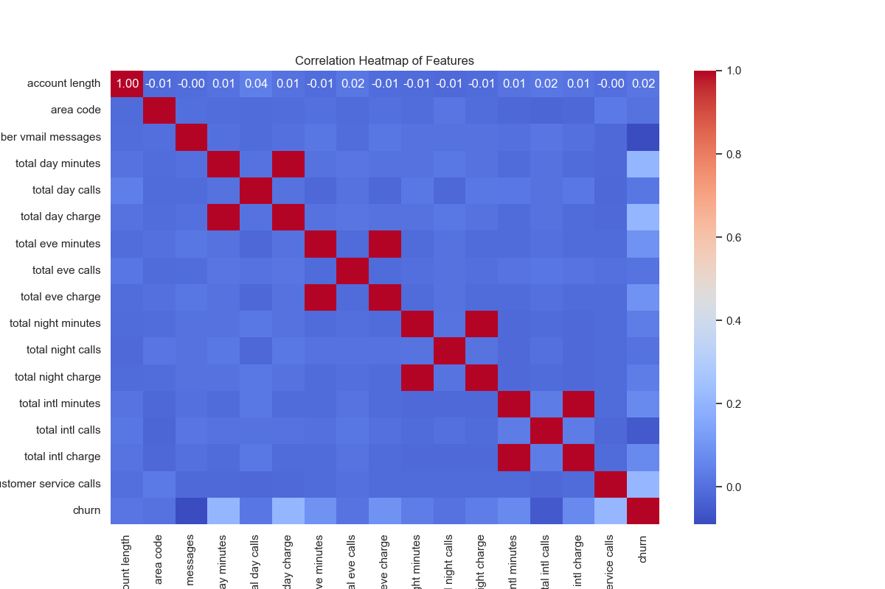
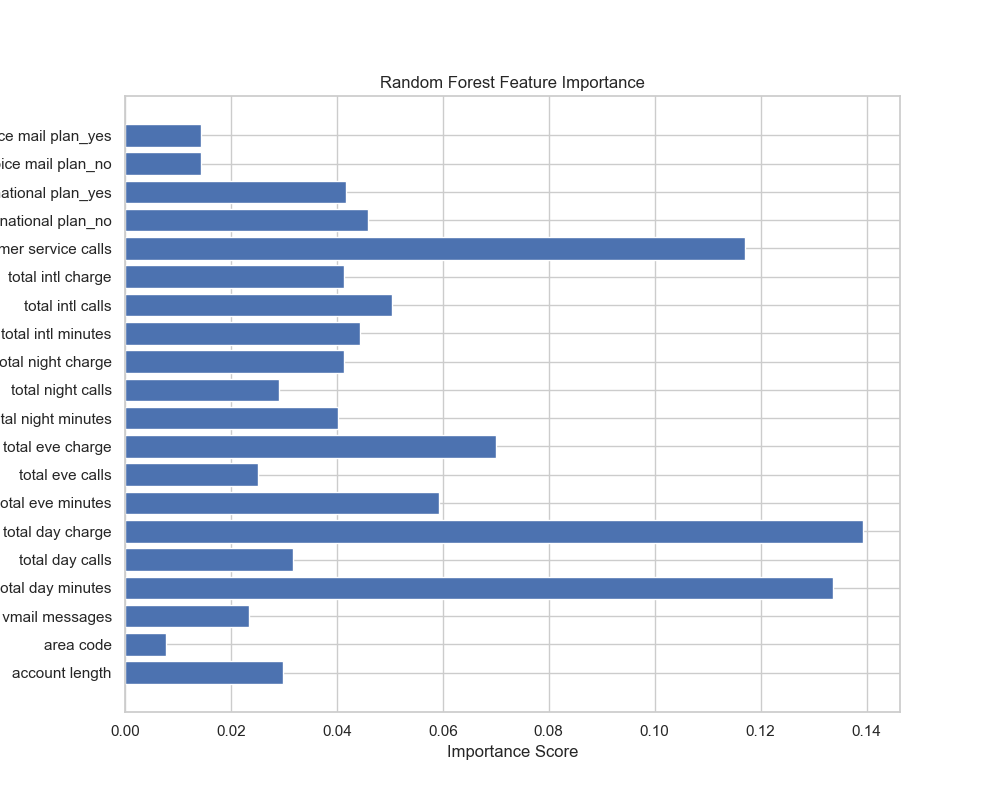
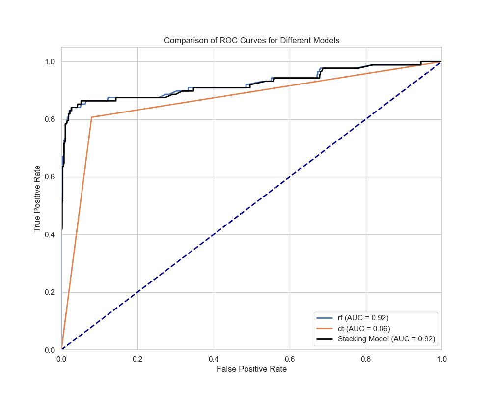

# **SyriaTel Customer Churn Prediction**

## **Overview**

The SyriaTel Customer Churn project aims to address the high rate of customer attrition within the telecommunications sector. Leveraging customer data such as service plans, call activity, and account details, we will build robust classification models to predict whether a customer is likely to churn. By understanding these patterns, SyriaTel can proactively enhance customer retention strategies, improve customer satisfaction, and reduce financial losses.

## **Business and Data Understanding**  

### **Stakeholder Audience**  

The primary stakeholders for this project include:

1. Customer Retention Team: Interested in understanding the factors leading to customer churn in order to develop effective strategies to retain customers.   
2. Upper Management: Focused on reducing churn rates to improve profitability and customer satisfaction, which are critical to the long-term success of the company.  

### **Dataset Choice**  

We used a telecommunications dataset that includes customer demographics, service usage, and billing information. This dataset is ideal for modeling churn because it captures relevant customer behaviors and service interactions that are indicative of churn risk.   

### **Key Features in the Dataset:**  

* Account Length  
* Area Code  
* Number Vmail Messages  
* Total Day Minutes  
* Total Eve Minutes  
* Total Night Minutes  
* Customer Service Calls  
* International Plan  
* Voice Mail Plan  

## **Modelling**  

We explored several models to predict customer churn:  

* **Logistic Regression:** Established as the baseline model due to its simplicity and interpretability.  
* **Decision Tree Classifier:** Captured non-linear relationships and provided insights into the most important features.  
* **Random Forest Classifier:** Improved accuracy by reducing overfitting compared to the decision tree.  
* **Stacking Ensemble Model:** Combined the strengths of multiple models to achieve the best performance.  

## **Feature Importance**  

We analyzed feature importance across models to identify key drivers of churn. The most influential features included customer service calls, total day minutes, and whether a customer had an international plan.  

## **Evaluation**  

### **Metrics**  
The models were evaluated using the following metrics:  

* Accuracy: The percentage of correct predictions.  
* Precision and Recall: To balance the trade-off between false positives and false negatives.  
* ROC-AUC Score: To assess the overall performance of the models in distinguishing between churn and non-churn customers.  

Best Model: The Stacking Ensemble Model achieved the highest performance with an ROC-AUC score of 0.92, making it the recommended model for deployment.  

## **Conclusion**  
### **Findings**  

* **Key Determinants of Churn:** The analysis revealed that customer service calls and international plan were the most significant factors influencing churn. Frequent calls to customer service indicated dissatisfaction, while having an international plan correlated with lower churn rates.  
* **Model Performance:** The stacking ensemble model outperformed individual models, demonstrating the value of combining multiple algorithms for better prediction accuracy.   

### **Implications**  

* Customer Service: SyriaTel should focus on improving customer service quality as frequent service interactions are linked to higher churn.  
* Targeted Marketing: Offering international plans or enhancing existing ones could be an effective retention strategy for at-risk customers.  

## **Recommendations** 

* **Enhance Customer Service:** Implement training programs for customer service representatives to reduce negative interactions that lead to churn.  
* **Promote International Plans:** Increase marketing efforts around international plans to retain customers who are likely to leave.  
* **Monitor High-Risk Customers:** Develop a monitoring system for customers who frequently contact customer service, allowing for proactive engagement before they churn.  
* **Continuous Model Improvement:** Regularly update the model with new data to ensure it remains accurate over time and adapts to changing customer behaviors.  

# **Visualization**

## Overview

This project focuses on predicting customer churn for SyriaTel using a combination of classification models, including Decision Trees, Random Forests, and a Stacking Ensemble model. Understanding the factors that influence customer churn is critical for developing effective retention strategies.

*Figure 1: Distribution of Churn vs. Non-Churn Customers*

## Business and Data Understanding

The dataset contains features such as account length, total day minutes, customer service calls, and more. A correlation heatmap provides insights into the relationships between these features.

*Figure 2: Correlation Heatmap of Features*

## Modeling

Multiple models were trained and evaluated to predict customer churn. The Random Forest model's feature importance highlights which factors are most influential in predicting churn.

*Figure 3: Feature Importance from Random Forest Model*

The ROC curve for the best-performing model, the Stacking Ensemble, is shown below.

## Evaluation

A comparison of ROC curves for different models illustrates their performance in predicting customer churn.

*Figure 5: Comparison of ROC Curves for Different Models*

## Conclusion

The analysis indicates that customer service calls and total day minutes are significant predictors of churn. Based on these insights, targeted retention strategies can be developed.

## Recommendations

1. **Customer Service Improvement:** Focus on improving the quality of customer service, as frequent calls to customer service strongly predict churn.
2. **Targeted Retention Programs:** Develop targeted retention programs for customers with high day-time usage to prevent potential churn.
3. **Continuous Monitoring:** Regularly monitor these key indicators to proactively identify at-risk customers.

